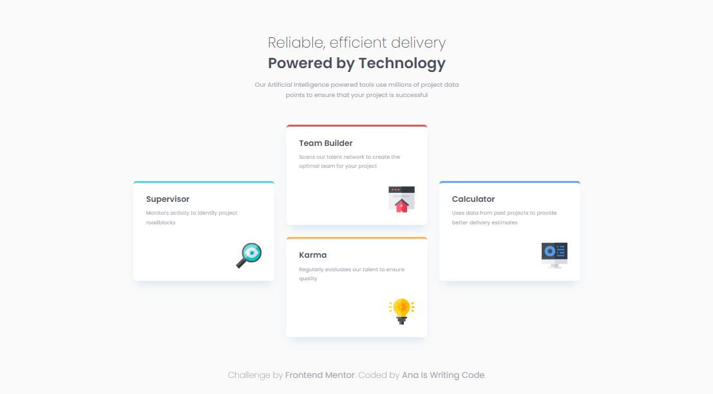

# Four card feature section | Frontend Mentor

This is a solution to the [Four card feature section challenge on Frontend Mentor](https://www.frontendmentor.io/challenges/four-card-feature-section-weK1eFYK) that takes **responsive design** into account.

## Table of contents

- [Overview](#overview)
- [My process](#my-process)
- [Author](#author)
- [Acknowledgments](#acknowledgments)

## Overview

The challenge required that users should be able to:

- View the optimal layout for the site depending on their device's screen size

## My process

In this project I implemented:

- BEM notation
- Custom CSS properties
- Media queries
- Mobile-first approach
- Semantic HTML
- Responsive design
- Grid areas

## Author

- GitHub - [@anaiswritingcode](https://github.com/anaiswritingcode)
- Frontend Mentor - [@anaiswritingcode](https://www.frontendmentor.io/profile/anaiswritingcode)
- Codecademy - [@anaiswritingcode](https://www.codecademy.com/profiles/anaiswritingcode)

## Acknowledgments

Thanks to [Kevin Powell](https://www.youtube.com/@KevinPowell) for his explanation on grid areas.
